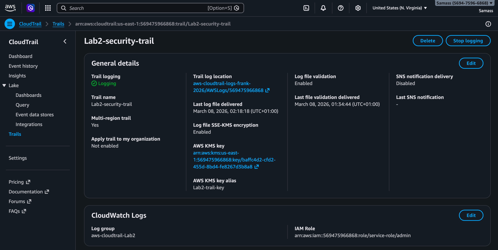
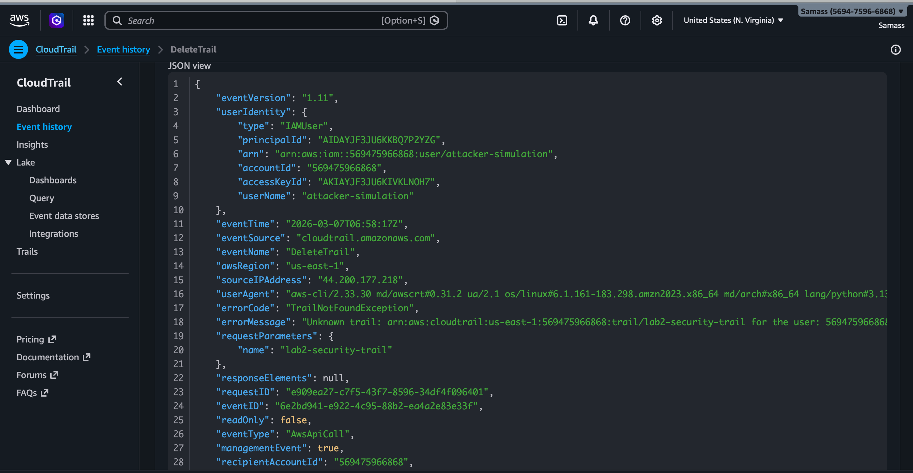
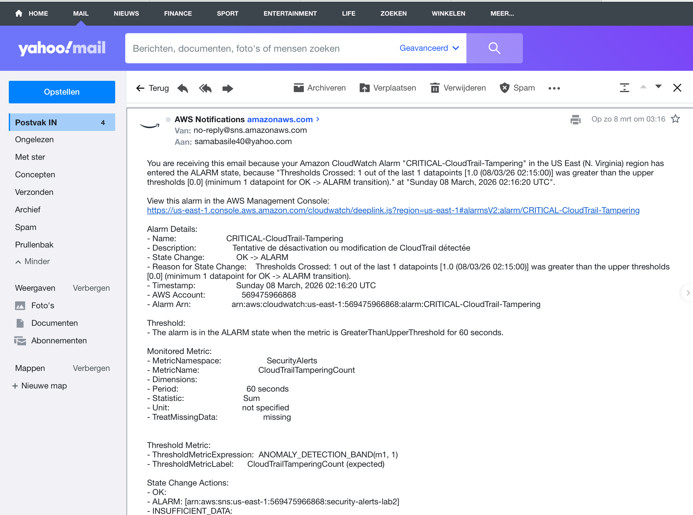

# 🔐 AWS CloudTrail Security Monitoring — Lab 

> Système de détection des menaces en temps réel sur AWS.  
> Taux de détection : **100%** | Délai moyen : **< 2 minutes**

## 🏗️ Architecture
```
AWS API Call → CloudTrail → CloudWatch Logs → Metric Filter → Alarm → SNS → Email
```

## 🛠️ Stack technique

| Service | Rôle |
|---|---|
| AWS CloudTrail | Journalisation multi-région |
| Amazon CloudWatch | Filtres métriques + alarmes |
| Amazon SNS | Notifications email temps réel |
| AWS KMS | Chiffrement des logs |
| AWS IAM | Simulation d'attaquant |

## 🎯 Attaques simulées (MITRE ATT&CK for AWS)

| # | API Call | Technique | Sévérité |
|---|---|---|---|
| 1 | `iam:ListUsers` | T1087 — Discovery | MEDIUM |
| 2 | `s3:ListBuckets` | T1526 — Discovery | MEDIUM |
| 3 | `cloudtrail:DeleteTrail` | T1562 — Defense Evasion | HIGH |
| 4 | `iam:CreateUser` | T1136 — Persistence | HIGH |

## 📊 Résultats

- ✅ 4/4 attaques détectées — taux de détection **100%**
- ✅ Délai moyen de détection **< 2 minutes**
- ✅ 3 filtres CloudWatch actifs

## 📸 Screenshots

**1. Trail configuré — multi-région, chiffrement KMS**


**2. Log CloudTrail JSON — événement DeleteTrail capturé**


**3. Alarme CRITICAL déclenchée — alerte SNS reçue**


## 📄 Rapport complet

→ [Rapport d'audit PDF](docs/rapport_audit_lab2.pdf)
